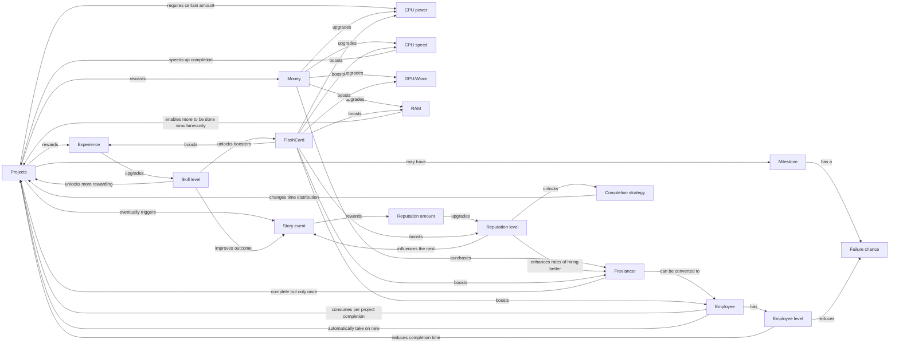
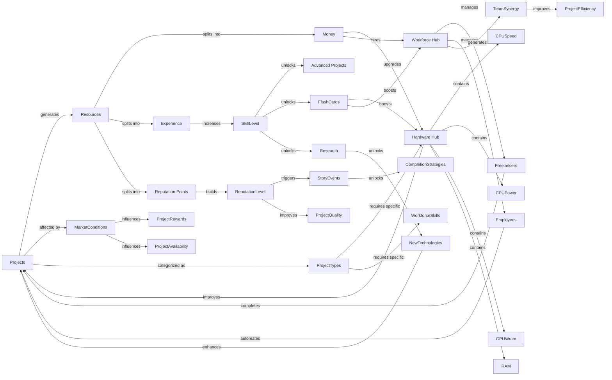
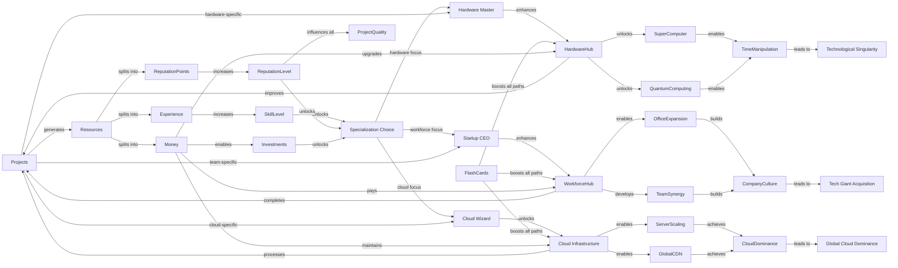

- [X] The player can complete a project and earn its first reward.
- [X] Distinguish between active and inactive projects (row layout, bench on the left, proposed project on the right).
- [X] Fix the card layout issue
- [X] Start the game with only one inactive project, that the player can attempt to drag in its active project bench.
- [X] drag area feedback
- [X] modify the flippable card to handle project progression only in inprogress projects
- [ ] add feedback when project cannot be started (unsufficient prereq etc...)
- [X] Once a project is completed, it should be removed from the list and the reward should be given to the player.

- [ ] Refactor game state notifier to split handleClick into separate methods and use listenSelf

- [ ] Generate a new random projects when the player completes a project.
- [ ] Handle api call + project generation in the client
- [ ] Create api to generate and cache projects

- [X] Change base layout
- [ ] Add autoclicking mechanic -> player can use money to hire freelancer to complete projects for him
- [ ] Add saving game state
- [ ] Add loading game state
- [ ] Add random event mechanic

- [ ] View for the completed projects page

notes
 - available projects have a cooldown timer before a new one appears after the last one is completed
 - the amount of available project slot is upgradable
 - merge reputation level and xp level

 Narrative/gameplay phases:
 - Student
  - 
 - Employee
 - CEO

Ideas
unlockable features on progression
 - alternating between working on project and studying
 - know the exact time to complete a project (initially no clue but a range)
 - know the failure chance of a project (initially no clue but a range)
 - know the reward of a project (initially no clue but a range)
 - able to save/load game state
 - able to generate new projects
 - know the reward of an available project
 - event: coffe boost: x2 project completion speed

 3 different pages
 - personnal page - own projects + hardware + upgrades
 - team page - team projects + hardware + upgrades
 - completed projects page + flashcards

finishing the game loop
 - [ ] define progression system
 - [ ] define levelup reward for each level (flashcards)

 progression

game context:
I am designing an incremental game where you "complete" projects to earn experience and money.
You start as a computer science student and grind your way to become an AI overlord.
The primary resources are experience and money. 
Experience allows you to level up which unlocks a pack of random knowledge flashcards about various comp-sci concepts and a passive bonus.
Flashcards have rarity, the more rare the card the bigger the bonus.
Common topics flashcards unlocks higher bonuses.
The secondary resources (hardware) are:
 - CPU speed -> speed up personal project completion
 - CPU power -> increase better project reward chances-bracket
 - GPU/Wram -> ???
 - mental load -> each project takes a specific amount of mental load during completion, more mental load = more project that can be completed at the same time.

The game is divided into 3 narrative phases, the first one is the student, the projects you complete can only reward experience
Second one is employee, your projects can reward money as well to upgrade your hardware.
Third one is startup-company, you unlock the ability to hire freelancers who will complete one project for you, you can later unlock the ability to hire them permanently.

Projects are generated randomly using LLM to create fun and humorous project name/description to keep the player engaged.

During gameplay random story events can appear, the player can choose a direction to influence the outcome of the event and affect its reputation level. Reputation level affects the probability to hire better freelancer (hiring process has some randomness in it)

Reputation level also unlocks completion strategy that influence the way multiple projects are completed like :
- FIFO - first active projects gets all the clicks
- Catch up - attempt to complete all the active projects at the same time
- Random - random distribution with a small chance of clicking bonus.
- Collaborative - portion of the hired freelances goes to complete the active projects.

Ultimately multiple endings could be considered :
- hardware master (lots of hardware upgrades, allowing for ultra fast project completion)
- startup CEO (lots of freelancer - conversion to startup, allowing a lot of multiple projects to be active at the same time)
- cloud wizard (cloud migration allowing for completion of ultra high project prerequisites to be taken)

4 types of project:
- learning: 
  (-) + completion time
  (+) + XP
- design:
  (-) takes more mental load
  (+) if coupled with implementation gains + xp and + money
- implementation:
  (-) has a probability to fail
  (+) if coupled with design gains + xp and + money
- optimization:
  (-) no reward
  (+) permanently reduce probability of implementation failure

feature/levels unlock
1. save/load game
2. 
3.
4.
5.
6.
7.
8.
9.
10.
11.
12.
13.
14.
15.
16.
17.
18.
19.
20.

