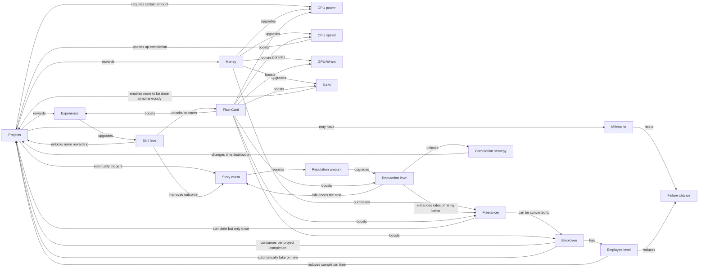
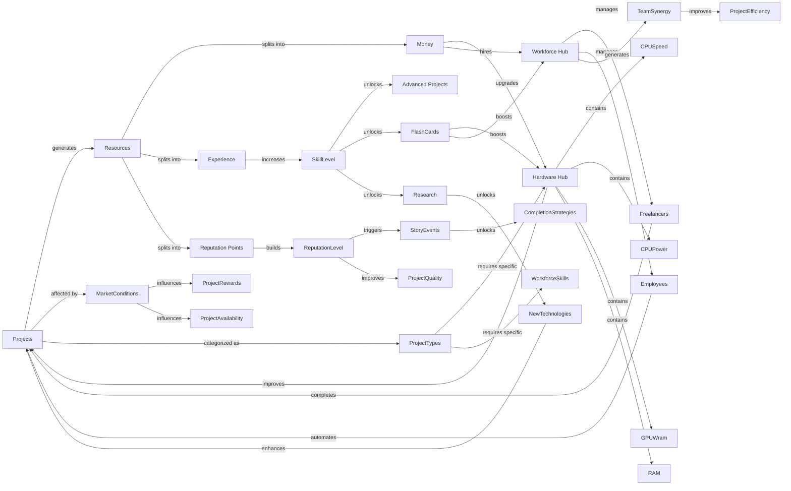
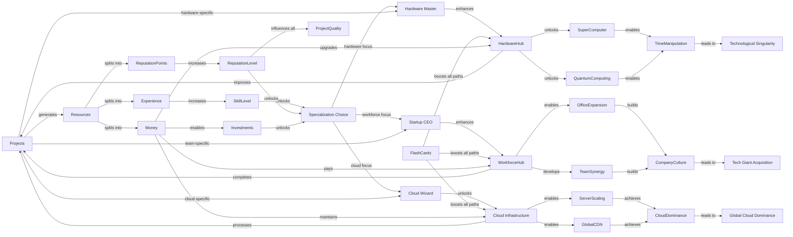

- [X] The player can complete a project and earn its first reward.
- [X] Distinguish between active and inactive projects (row layout, bench on the left, proposed project on the right).
- [X] Fix the card layout issue
- [X] Start the game with only one inactive project, that the player can attempt to drag in its active project bench.
- [X] drag area feedback
- [X] modify the flippable card to handle project progression only in inprogress projects
- [ ] add feedback when project cannot be started (unsufficient prereq etc...)
- [X] Once a project is completed, it should be removed from the list and the reward should be given to the player.

- [ ] Refactor game state notifier to split handleClick into separate methods and use listenSelf

- [ ] Generate a new random projects when the player completes a project.
- [ ] Handle api call + project generation in the client
- [ ] Create api to generate and cache projects

- [X] Change base layout
- [ ] Add autoclicking mechanic -> player can use money to hire freelancer to complete projects for him
- [ ] Add saving game state
- [ ] Add loading game state
- [ ] Add random event mechanic

- [ ] View for the completed projects page

notes
 - available projects have a cooldown timer before a new one appears after the last one is completed
 - the amount of available project slot is upgradable
 - merge reputation level and xp level

Ideas
unlockable features on progression
 - know the exact time to complete a project (initially no clue but a range)
 - know the failure chance of a project (initially no clue but a range)
 - know the reward of a project (initially no clue but a range)
 - able to save/load game state
 - able to generate new projects
 - know the reward of an available project

 3 different pages
 - personnal page - own projects + hardware + upgrades
 - team page - team projects + hardware + upgrades
 - completed projects page + flashcards

finishing the game loop
 - [ ] define progression system
 - [ ] define levelup reward for each level (flashcards)

 progression

