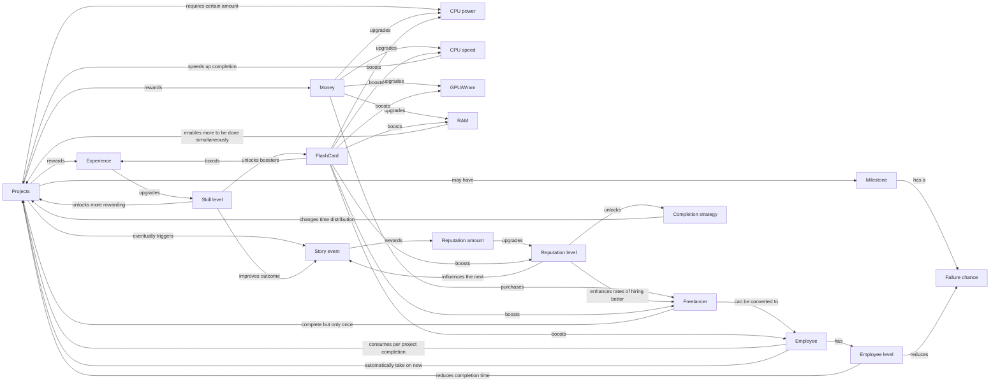
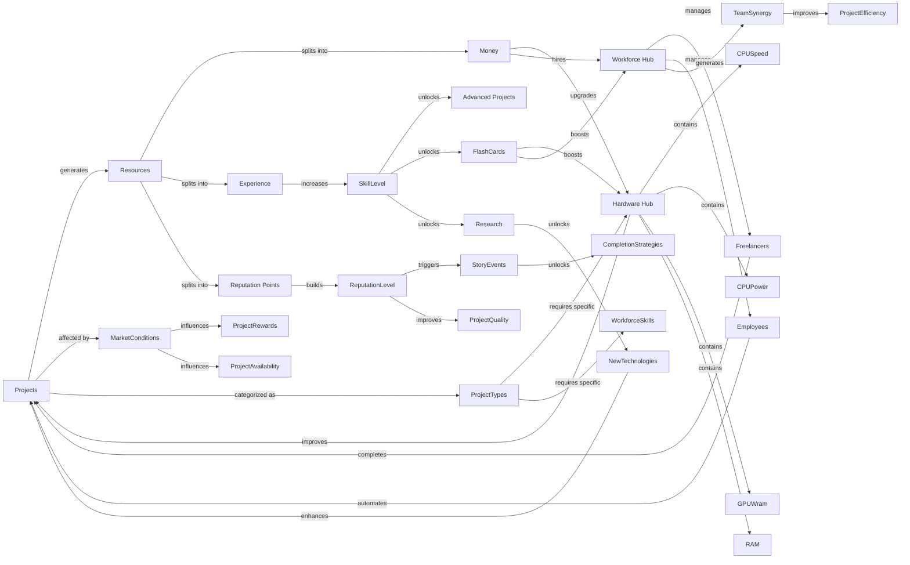
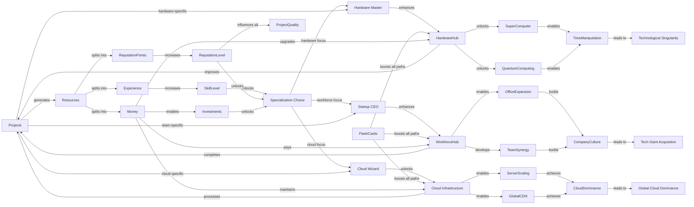

game context:
I am designing an incremental game where you "complete" projects to earn experience and money.
You start as an developer intern and grind your way to become an AI overlord.
The primary resources are experience and money. 
Experience allows you to level up which unlocks a pack of random knowledge flashcards about various comp-sci concepts and a passive bonus.
Flashcards have rarity, the rarer the card the bigger the bonus.
Common topics flashcards unlocks higher bonuses.
The secondary resources (hardware) are:
 - Tech skills -> Determines the complexity of projects you can take on, Affects the probability of getting better rewards, Could influence the ability to mentor/train hired freelancers later
 - Development Tools -> Affects project completion speed, Could unlock automation features later in the game, Influences the efficiency of your freelancer team
 - Hardware -> Determines the scale of projects you can handle, Could enable passive resource generation (SaaS type project-reward taht would enable passive resource gain)
 - focus point -> each project takes a specific amount of focus point during completion, more focus point = more project that can be completed at the same time. Could add a quality multiplier to project rewards when you have excess focus

The game is divided into 3 narrative phases, the first one is the intern-freelancer.
Second one is employee, your projects can reward money as well to upgrade your hardware.
Third one is startup-company, you unlock the ability to hire freelancers who will complete one project for you, you can later unlock the ability to hire them permanently.

Projects are generated randomly using LLM to create fun and humorous project name/description to keep the player engaged.

Ultimately multiple endings could be considered :
- hardware master (lots of hardware upgrades, allowing for ultra fast project completion)
- startup CEO (lots of freelancer - conversion to startup, allowing a lot of multiple projects to be active at the same time)
- cloud wizard (cloud migration allowing for completion of ultra high project prerequisites to be taken)

4 types of project:
- learning -> green: 
  (-) + completion time
  (+) + XP
- design -> blue:
  (-) takes more focus point
  (+) if coupled with implementation gains + xp and + money
- implementation -> purple:
  (-) has a probability to fail
  (+) if coupled with design gains + xp and + money
- optimization -> orange:
  (-) no reward
  (+) permanently reduce probability of implementation failure

feature/levels unlock
1. save/load game
2. 
3.
4.
5.
6.
7.
8.
9.
10.
11.
12.
13.
14.
15.
16.
17.
18.
19.
20.

